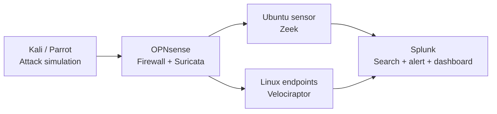
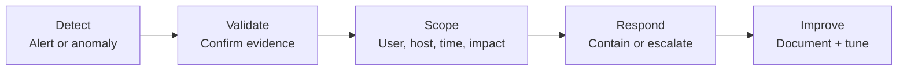

# Farhan Fathah — Cybersecurity Portfolio


> IT & NOC operations professional transitioning into a SOC Analyst role, with hands-on experience building and investigating a multi-layer home security lab.

**UAE · Open to SOC Analyst L1 / Cybersecurity Operations opportunities**

## Profile

I bring 13 years of experience across enterprise IT support, NOC monitoring, identity, networking, endpoint administration, and incident ownership. I am now applying that operational foundation to cybersecurity: validating alerts, correlating evidence, defining impact, and communicating actionable next steps.

My portfolio focuses on investigation quality—not simply installing tools.

### Credentials


## Home SOC lab



| Layer | Technology | Purpose |
|---|---|---|
| Attack simulation | Kali Linux, Parrot OS | Generate controlled scans and authentication activity |
| Network control | OPNsense, Suricata | Firewall policy, traffic visibility, IDS/IPS alerts |
| Network detection | Zeek | Connection, DNS, host, and protocol telemetry |
| Endpoint visibility | Velociraptor | Artifact collection, endpoint queries, and hunts |
| SIEM | Splunk | Centralized ingestion, correlation, searches, alerts, and dashboards |
| Target systems | Ubuntu, Metasploitable 2 | Generate realistic host and service evidence |

## Featured investigations

### 1. SSH brute-force investigation

**Objective:** Identify repeated SSH authentication failures and determine whether they resulted in compromise.

**What I did**

- Generated controlled SSH failures from Kali Linux.
- Forwarded Linux authentication logs to Splunk.
- Extracted source IP addresses and grouped events into five-minute windows.
- Built threshold logic for five or more failed attempts.
- Checked for a successful login from the same source after the failures.
- Reviewed the account, target host, time range, and adjacent activity.
- Defined escalation conditions and documented the analyst conclusion.

```spl
index=* "Failed password"
| rex field=_raw "from (?<src_ip>\d{1,3}(?:\.\d{1,3}){3})"
| where isnotnull(src_ip)
| bin _time span=5m
| stats count as failed_events values(user) as targeted_users by _time src_ip host
| where failed_events >= 5
| sort -_time
```

**Investigation decision:** Escalate when failures are followed by a successful login, a privileged account is targeted, the source appears malicious, or related lateral movement is present.

### 2. Password-spraying analysis

Analyzed one-password-to-many-accounts behavior, compared it with brute force, and identified the aggregation fields required to detect broad account targeting without over-alerting on ordinary user mistakes.

### 3. Zeek-to-Splunk network pipeline

Built Zeek from source on ARM Ubuntu, captured traffic from the lab network, validated `conn.log` and `dns.log`, and designed the forwarding path into Splunk for network-led investigations.

### 4. Velociraptor endpoint visibility

Deployed a Velociraptor server and ARM clients, confirmed endpoint services and check-ins, and explored artifact collection for Linux authentication and host evidence.

## My investigation method



1. **Validate the alert:** confirm that the event exists and the data is reliable.
2. **Establish context:** identify the source, destination, user, asset, and time window.
3. **Scope the activity:** search for related events before and after the trigger.
4. **Assess impact:** determine whether access succeeded, privileges changed, or movement occurred.
5. **Decide and communicate:** close as benign, continue monitoring, contain, or escalate with evidence.
6. **Improve detection:** tune the query, add context, and record lessons learned.

## Capability map

- **SIEM and monitoring:** Splunk, QRadar learning, searches, alerts, dashboards, triage, false-positive analysis
- **Network security:** Zeek, Suricata, OPNsense, TCP/IP, DNS, DHCP, routing, Wireshark
- **Identity:** Active Directory, Microsoft Entra ID, Conditional Access, MFA, Identity Protection
- **Endpoint and DFIR:** Velociraptor, Intune, SCCM, Windows and Linux administration
- **Operations:** ITIL, incident/problem/change management, ServiceNow, SLA/KPI ownership
- **Scripting:** Python fundamentals and security automation learning

## Certifications and learning

- ISC2 Certified in Cybersecurity (CC)
- Microsoft Certified: Identity and Access Administrator Associate (SC-300)
- CEH training / certification track
- CCNA-level networking knowledge
- Cybersecurity internship — Government of India
- AI/ML using Python — in progress

## Next plans

- [ ] Publish full case studies for SSH brute force and password spraying.
- [ ] Add investigations for suspicious PowerShell, port scanning, privilege escalation, and web attacks.
- [ ] Complete Zeek and OPNsense/Suricata ingestion into Splunk.
- [ ] Normalize fields and map detections to MITRE ATT&CK techniques.
- [ ] Build Microsoft Sentinel and Defender for Endpoint labs.
- [ ] Add screenshots of queries, timelines, dashboards, and investigation notes to every case study.
- [ ] Create small Python tools for enrichment and detection validation.
- [ ] Transition into a UAE SOC Analyst L1 role.

## Repository structure

```text
cybersecurity-portfolio/
├── README.md                 # GitHub portfolio
└── dist/                     # GitHub Pages-ready website
    ├── index.html
    ├── styles.css
    ├── script.js
    └── assets/
        └── cyber-defense-hero.png
```

## Publish on GitHub Pages

1. Create a public GitHub repository and upload this folder.
2. Open **Settings → Pages** and select **GitHub Actions** as the source.
3. The included workflow publishes the `/dist` website automatically after each push to `main`.
4. Wait for the workflow to finish, then open the GitHub Pages URL shown in the deployment.

---

*This portfolio documents controlled lab activity performed for defensive learning. No testing is conducted against systems without authorization.*
